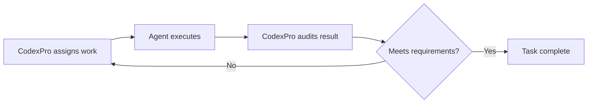

<p align="center">
  
</p>

<h1 align="center">CodexPro</h1>

<p align="center">
  Local coding tools for ChatGPT, scoped to explicitly allowed projects.
</p>

<p align="center">
  <a href="https://www.npmjs.com/package/codexpro"></a>
  <a href="https://github.com/rebel0789/codexpro/actions"></a>
  <a href="https://github.com/rebel0789/codexpro/blob/main/LICENSE"></a>
  <a href="https://rebel0789.github.io/codexpro/"></a>
</p>

## Install

Requirements:

- Node.js 20+
- A ChatGPT account with Apps / Developer Mode access
- One HTTPS route to your local machine when connecting ChatGPT from the web

Install the CLI:

```bash
npm install -g codexpro
```

Run setup inside the repo you want ChatGPT to work on:

```bash
cd /path/to/your/repo
codexpro setup
```

CodexPro prints and copies the Server URL. In ChatGPT, open:

```text
Settings -> Security and login -> Developer mode: on
Settings -> Plugins -> Plugins tab -> + (beside Search plugins)
```

This opens **New Plugin**. Give it a name such as `CodexPro`, paste the Server URL in the **Server URL** connection option, then choose `Authentication: No Authentication / None`. The form may initially show OAuth; change it before creating the plugin. CodexPro uses its own URL token.

### Current Plugins UI

| Open Plugins and click `+` | Complete the New Plugin form |
| --- | --- |
|  |  |

Daily use from the same repo:

```bash
codexpro start
```

## What It Does

CodexPro starts a local MCP server for the current workspace. ChatGPT can then:

- read files and inspect the repo
- search code
- make scoped edits with `write`, `edit`, or guarded `apply_patch`
- run safe verification commands through `bash`
- review changed files with `show_changes`
- write handoff plans under `.ai-bridge`
- export a selected context bundle for model surfaces that cannot call tools

CodexPro is not a hosted service, model proxy, quota bypass, account pool, or OS sandbox.
It connects your own ChatGPT session to your own local repo through the official Developer Mode / MCP app path.

## Multiple Projects

Keep one launch project and explicitly allow additional projects:

```bash
codexpro settings set --project ~/code/web --project ~/code/api
codexpro start
```

`open_workspace` selects an allowed project for the current MCP session. After that, tools can omit `workspace_id` and operate on the selected project. `open_current_workspace` returns the session to the launch project.

Selections are session-local, so one MCP session switching projects does not change another session. Whether separate ChatGPT conversations receive separate MCP sessions is controlled by the client. Keep using separate CodexPro processes when you need guaranteed process isolation, different permissions, or different public endpoints.

Only the launch project and projects explicitly added with `--project` can be opened. Remove saved additional projects with:

```bash
codexpro settings set --clear-projects
```

## Relaunch Coding Experience

- `view_image` sends PNG, JPEG, GIF, and WebP files as native MCP image content, so ChatGPT can inspect screenshots and visual assets without a separate upload.
- `read` returns a SHA-256. Pass it as `expected_sha256` to `write` or `edit` when multiple sessions may touch the same file. A stale edit fails instead of silently overwriting newer work.
- New files use same-directory atomic replacement. Existing files are updated in place so ownership, ACLs, extended attributes, and hard links remain attached; a machine or process crash during that write can leave partial content.
- `codexpro start --headless` runs without prompts, clipboard access, browser opening, or terminal controls. It prints one `CODEXPRO_READY` line, publishes the supervised runtime PID in local status, cleans up on signals, and exits nonzero if the HTTP runtime dies unexpectedly.

## Repository Analysis

CodexPro builds a bounded repository map from local manifests, source declarations, imports, tests, and Git state. It provides:

- `inspect_workspace` for languages, project types, entrypoints, areas, symbols, and relationships
- optional structured `search` intents: `text`, `symbol`, `references`, and `impact`
- affected-area, risk, related-test, and focused-command recommendations in `show_changes`
- matching read-only terminal views:

```bash
codexpro inspect --root /path/to/repo
codexpro review --root /path/to/repo
codexpro inspect --root /path/to/repo --json
```

The analysis is deterministic and local. It uses confidence labels instead of claiming compiler precision, stays within configured file/byte/symbol limits, and falls back to normal lexical search and Git review when analysis is incomplete.

Set `CODEXPRO_ANALYSIS=0` to disable repository analysis without changing the rest of the connector.

## Normal Commands

```bash
codexpro setup
codexpro start
codexpro start --root /path/to/repo
codexpro doctor
codexpro connection-test --root /path/to/repo
codexpro settings
codexpro inspect
codexpro review
```

Useful modes:

```bash
codexpro start --no-bash
codexpro start --tool-mode minimal
codexpro start --tool-mode full
codexpro start --mode handoff
codexpro start --mode pro
```

If ChatGPT cannot create the plugin, run `codexpro connection-test`. It keeps
the normal read, tree, search, and skill tools, disables writes, bash, and tool
cards, and logs whether a request reached the local MCP endpoint.

Tool cards are opt in:

```bash
CODEXPRO_TOOL_CARDS=1 codexpro start
```

The v10 cards cover selected workspace, analysis, change, Git, handoff, and
terminal results. Reads and searches stay in normal chat output. After updating
the connector, refresh its ChatGPT plugin connection once so it loads the new
widget resource.

## Public URL Options

ChatGPT web needs a public HTTPS Server URL. CodexPro supports:

- Fast demo URL: `codexpro start --tunnel cloudflare`
- Stable ngrok domain: `codexpro ngrok --hostname your-domain.ngrok-free.dev`
- Stable Cloudflare route: `codexpro stable --hostname codexpro.example.com --tunnel-name codexpro`
- Tailscale Funnel: `codexpro tailscale --hostname your-device.your-tailnet.ts.net`
- Local only: `codexpro start --tunnel none`

Cloudflare quick tunnels honor `HTTPS_PROXY`, `ALL_PROXY`, or `HTTP_PROXY` when those env vars are set.

Stable modes should use a stable CodexPro token:

```bash
mkdir -p ~/.codexpro
openssl rand -hex 32 > ~/.codexpro/http-token
chmod 600 ~/.codexpro/http-token

codexpro tailscale \
  --hostname your-device.your-tailnet.ts.net \
  --token-file ~/.codexpro/http-token
```

Tailscale Funnel must already be allowed for your tailnet. It requires MagicDNS, HTTPS certificates, and Funnel policy support. CodexPro runs:

```bash
tailscale funnel http://127.0.0.1:8787
```

Then ChatGPT uses:

```text
https://your-device.your-tailnet.ts.net/mcp?codexpro_token=keep-this-token-stable
```

The URL token is a personal-use compatibility fallback for connector forms that cannot set
headers. Prefer `Authorization: Bearer <token>` when the MCP client supports
custom headers. Shared or multi-user production deployments require OAuth or
header authentication. CodexPro requires at least 24 token bytes, removes token
parameters from the local browser address after onboarding, and sends
no-store/no-referrer headers. Never share or commit the connector URL.

## Safety Defaults

- Public tunnel mode requires a CodexPro HTTP token.
- HTTP tokens shorter than 24 bytes are rejected and failed guesses are rate-limited per client address.
- Generic writes are hidden unless `CODEXPRO_WRITE_MODE=workspace`.
- Safe bash blocks broad shell patterns and secret/build/cache paths.
- Safe mode permits explicit-file `git add`, hook-disabled unsigned `git commit -m`, and option-free `git push origin <branch>` for verified local branches and HTTPS origins; broad staging, force, deleting, tag, and alternate-remote pushes remain blocked.
- `apply_patch` is workspace-scoped and rejects blocked paths, symlink patches, and secret-looking patch content.
- `show_changes` keeps a review checkpoint so repeated unchanged reviews collapse.
- Tool-card metadata is off unless `CODEXPRO_TOOL_CARDS=1`.

Read [SECURITY.md](SECURITY.md) before exposing CodexPro through any tunnel.

## RAM And ChatGPT Memory

CodexPro can reduce what it sends to ChatGPT. Current local fixes:

- binary-file checks scan with a reusable 64 KiB buffer instead of allocating the whole file
- ChatGPT tool-card structured payloads are compacted only for card output, not for normal tool data
- bash chat transcripts stay compact by default

That helps avoid oversized MCP/card payloads. It does not force Chrome, ChatGPT, or an old browser iframe to release memory that the client already holds. If the browser tab has already grown, reload the ChatGPT page or restart the browser.

## Repo Context

CodexPro uses explicit files, not hidden chat memory:

```text
AGENTS.md
.ai-bridge/current-plan.md
.ai-bridge/agent-status.md
.ai-bridge/decisions.md
.ai-bridge/open-questions.md
.ai-bridge/execution-log.jsonl
```

For non-tool model surfaces:

```bash
codexpro start --mode pro
```

Or from a local checkout:

```bash
codexpro pro-bundle --root /path/to/repo --copy
codexpro pro-apply --root /path/to/repo --file plan.md
```

## Handoff

ChatGPT can write a plan without executing a local agent:

```bash
codexpro start --mode handoff
```

Then you run execution locally:

```bash
codexpro execute-handoff --agent codex --yes
codexpro execute-handoff --agent pi --yes
codexpro execute-handoff --agent opencode --subagents --yes
codexpro watch-handoff --agent opencode --subagents --yes
```

`--subagents` runs a verified OpenCode investigation phase before implementation. CodexPro requires a real `task` tool event, a real child session ID, an exportable read-only child session, and returned evidence before it marks delegation as successful. If any of those checks fail, execution falls back to the normal single-agent path and records the reason instead of claiming a subagent ran. For the current test phase, the total subagent-attempt cap is hard-limited to `1` per handoff. Even if a larger `--max-subagents` or `CODEXPRO_MAX_SUBAGENTS` value is supplied, CodexPro clamps it to `1`, so the repository Explore child consumes the only slot and additional scout delegation is skipped.

After the temporary one-subagent test cap is lifted, handoffs that mention APIs, SDKs, dependencies, providers, releases, upstream projects, or external documentation can also route a separate read-only `gemini-scout` child for external research. It discovers Gemini Flash models from the local OpenCode catalog, prefers candidates with a visible provider credential, performs a bounded live probe, injects the selected model only at runtime, and verifies from the exported child session that the exact model was actually used. If no Gemini Flash candidate is healthy, the scout records a fallback reason and the normal repository investigation/fixer continues. Set `CODEXPRO_GEMINI_SCOUT_MODEL` to prefer a specific locally available authenticated Gemini Flash model, and use `codexpro doctor --live-scout-check --model <working-parent-model>` for an end-to-end scout check.

For bounded autonomous correction, use `loop-handoff` without `--review-command`. CodexPro preserves the original task as an immutable audit target, lets the executor work, optionally runs the configured test command, then launches the independent read-only `codexpro-auditor`. A FAIL verdict must include actionable fixes; CodexPro writes those fixes into the next `current-plan.md` and runs another iteration. The task completes only after the audit returns PASS and executor/test failures have not invalidated that PASS. An external `--review-command` is still available as an override.

```bash
codexpro loop-handoff --agent opencode --model opencode/big-pickle --subagents --run-tests "npm test" --max-iters 3 --yes
```



`npm run audit:live` runs a real read-only OpenCode audit fixture and requires an exportable audit session. Use `--audit-model <provider/model>` or `CODEXPRO_AUDIT_MODEL` when the audit should use a different model from the executor.

`handoff_to_agent` is planning-only over MCP. CodexPro does not expose arbitrary local agent execution as a remote ChatGPT tool.

## Troubleshooting

Run:

```bash
codexpro doctor
```

Common fixes:

- Quick tunnel URL changed: rerun `codexpro start` and update the ChatGPT app Server URL.
- Stable URL does not respond: check the tunnel provider first, then the CodexPro token.
- ChatGPT cannot call tools in one model/chat: switch to a ChatGPT surface that supports Developer Mode app actions.
- Local port is busy: start another repo with `--port 8788`.
- Tool list looks stale: create a new ChatGPT app entry or change the connector URL token.
- Windows Scheduled Task stopped after sleep, restart, or a process exit: run `npm run windows:recover`. This preserves existing triggers and adds one `IgnoreNew` recovery attempt every minute without starting a watchdog process.

## Development

```bash
npm install
npm run build
npm run smoke
npm run stress
```

### Windows desktop manager

The React + Electron manager shows Scheduled Task/MCP/tunnel health, copies or rotates the private MCP URL, and inspects saved or added repositories through CodexPro MCP. Build its installable Windows executable with:

```powershell
npm --prefix manager install
npm run manager:dist
```

### Chrome profile extension

Load the `chrome-extension` directory in each Chrome profile that should use CodexPro. The popup has two independent actions:

- **ACTIVE PROFILE NÀY** selects the one profile that `browser_control` may operate.
- **THÊM CODEXPRO VÀO CHATGPT** obtains the current private MCP URL from the loopback bridge, enables ChatGPT Developer mode when the account allows it, creates the app as **CodexPro** with **Server URL** and **No Auth**, opens a new chat, selects `@CodexPro`, calls `server_config`, and waits for `CodexPro READY`.

The private MCP URL is delivered only to the signed CodexPro extension origin and is not persisted by the extension. Each Chrome profile keeps its own installation result. ChatGPT plan, workspace role, or administrator restrictions can still prevent Developer mode from being enabled; the popup reports that condition instead of marking setup complete.

The installer is generated under `manager/release/`.

Useful release checks:

```bash
npm run release:check
git diff --check
```

Release only from the CodexPro project root. Do not use `npm --prefix` with
`npm pack` or `npm publish`: npm packs the current directory in that case.
The release scripts verify the root, package identity, canonical repository,
and tarball before publishing:

```bash
cd /path/to/codexpro
npm run release:publish
```

## Docs

- [Website](https://rebel0789.github.io/codexpro/)
- [FAQ](FAQ.md)
- [Security](SECURITY.md)
- [Worker plugins and API providers](docs/worker-plugins.md)
- [Stable URL guide](DOMAIN_SETUP.md)
- [Changelog](CHANGELOG.md)
